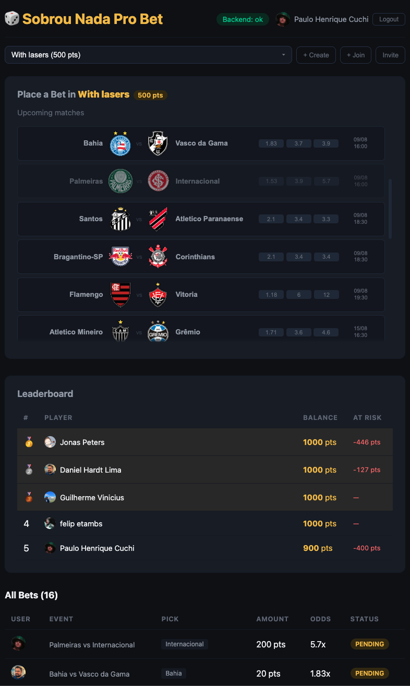

# 🎲 Sobrou Nada Pro Bet

[](https://github.com/cuchi/sobrou-nada-pro-bet/actions/workflows/ci.yml)

A cashless betting app for a closed beta — friends place points-based bets on Brazilian football matches (Brasileirão), compete in private groups, and climb the leaderboard.



## Prerequisites

- [Docker](https://docs.docker.com/get-docker/) (for PostgreSQL)
- [Rust](https://rustup.rs/) (2024 edition)
- [Node.js](https://nodejs.org/) 24+ and npm

## Quick Start

### 1. Database

```sh
docker-compose up -d
```

### 2. Backend

```sh
cd backend
cp .env.example .env
```

Edit `.env` and fill in:

| Variable | How to get it |
|---|---|
| `GOOGLE_CLIENT_ID` | [Google Cloud Console](https://console.cloud.google.com/) → Credentials → OAuth 2.0 Client ID |
| `JWT_SECRET` | `openssl rand -base64 32` |
| `ADMIN_TOKEN` | `openssl rand -base64 32` |
| `ODDS_API_KEY` | [the-odds-api.com](https://the-odds-api.com/) (free tier: 500 requests/month) |

```sh
cargo run   # http://localhost:3000
```

### 3. Frontend

```sh
cd frontend
cp .env.example .env.local
```

Edit `.env.local` and set `VITE_GOOGLE_CLIENT_ID` (same as backend).

```sh
npm install
npm run dev   # http://localhost:5173
```

## Syncing Events

Match data comes from [the-odds-api.com](https://the-odds-api.com/). You need an `ODDS_API_KEY` (free tier works) in your `backend/.env`.

Events are synced via the admin endpoint:

```sh
curl -X POST http://localhost:3000/admin/events/sync \
  -H "X-Admin-Token: your-admin-token-from-env"
```

This fetches all upcoming Brasileirão fixtures and their odds, upserting into the database. Run it whenever you want to refresh the match list.

In production, this should be a cron job or background worker — not exposed to users.

## Google OAuth Setup

1. Go to [Google Cloud Console](https://console.cloud.google.com/) → APIs & Services → Credentials
2. Create an **OAuth 2.0 Client ID** (Web application)
3. Add `http://localhost:5173` to **Authorized JavaScript Origins**
4. Under **OAuth consent screen**, add yourself as a Test User
5. Copy the Client ID into both `backend/.env` and `frontend/.env.local`

## Tech Stack

| Layer | Technology |
|---|---|
| Frontend | React 19, TypeScript 5.8, Vite 8 |
| Backend | Rust, Axum 0.8, SQLx 0.8 |
| Database | PostgreSQL 16 |
| Auth | Google OAuth + JWT |
| Match data | the-odds-api.com v4 |
